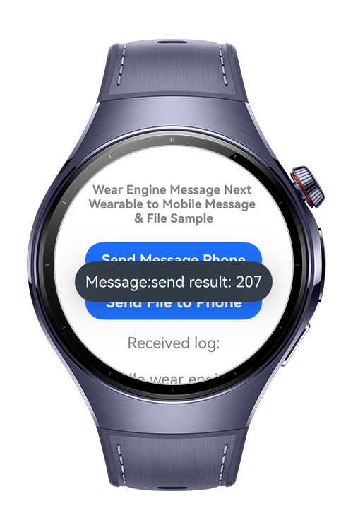

> **Note:** To access all shared projects, get information about environment setup, and view other guides, please visit [Explore-In-HMOS-Wearable Index](https://github.com/Explore-In-HMOS-Wearable/hmos-index).

# [HMOS Next Wearable to Phone] WearEngine Messaging, File Transfer & Receiver

This app demonstrates how to use the Huawei Wear Engine SDK.  
It enables an Android phone to communicate with a Huawei Smart Next Wearable device, allowing message and file exchange between the phone and the watch.


# Preview
<div>
  
  
  
</div>

# Use Cases

- Send messages from HMOS Next Wearable devices
- Send files from HMOS Next Wearable devices
- Receive messages on phone from the HMOS Next Wearable
- Receive files on phone from the HMOS Next Wearable

# Technology

## Stack

- **Languages**: ArkTS (Huawei LiteWearable)
- **Tools**: DevEco Studio 5.1.0.849
- **Libraries**: Wear Engine SDK
   - Huawei P2P Messaging
   - Huawei P2P Receive File & Message


# Directory Structure

```
HMOS Next Wearable
├───ets
│   ├───hiwearmainability
│   │       HiWearMainAbility.ets
│   │       
│   ├───pages
│   │       Index.ets
│   │
│   └───Services
└───resources
    ├───base
    │   ├───element
    │   │       color.json
    │   │       float.json
    │   │       string.json
    │   │
    │   ├───media
    │   │       background.png
    │   │       foreground.png
    │   │       layered_image.json
    │   │       startIcon.png
    │   │
    │   └───profile
    │           main_pages.json
    │
    ├───rawfile
    └───resfile
            test.txt
```


# Constraints and Restrictions
## Requirements

1. **Huawei DevEco IDE**: Required for developing the Huawei watch app.
2. Configure signing settings index.ets and please do not forget change module.json `YOUR_PHONE_APP_BUNDLE_NAME`:
   - `YOUR_PHONE_APP_BUNDLE_NAME`
   - `YOUR_PHONE_APP_FINGERPRINT`

## Supported Devices

- Huawei Watch 5


## Documentation
- [Applying for Wear Engine Service](https://developer.huawei.com/consumer/en/doc/connectivity-Guides/applying-wearengine-0000001050777982)
- [Next Wearable App Development via Wear Engine](https://developer.huawei.com/consumer/en/doc/harmonyos-guides/wear-engine-kit-guide)


# License

**[HMOS Next Wearable to Phone] WearEngine Messaging, File Transfer & Receiver** is distributed under the terms of the MIT License.  
See the [LICENSE](/LICENSE) file for more details.